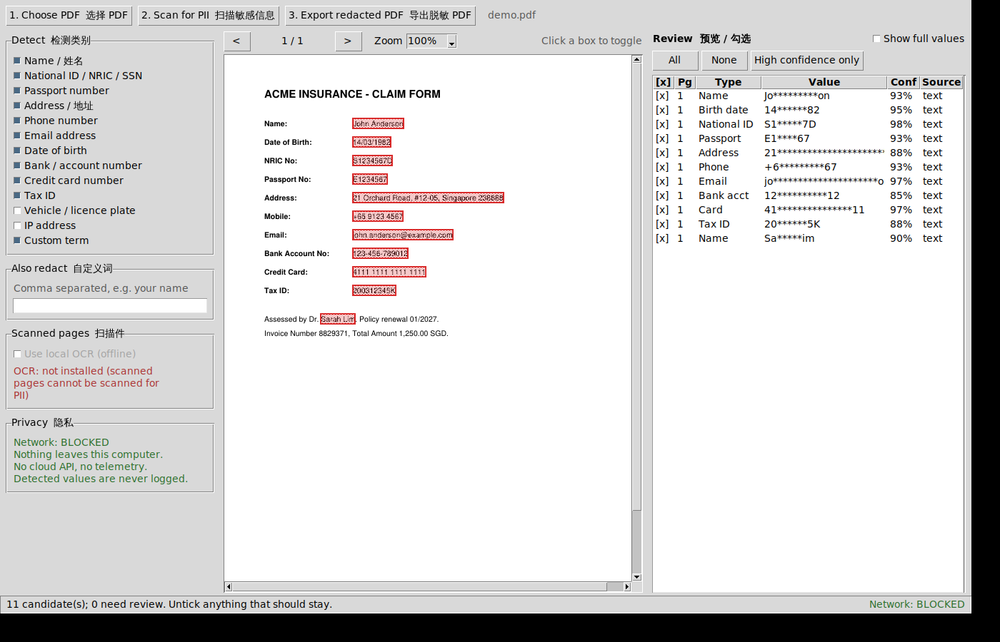
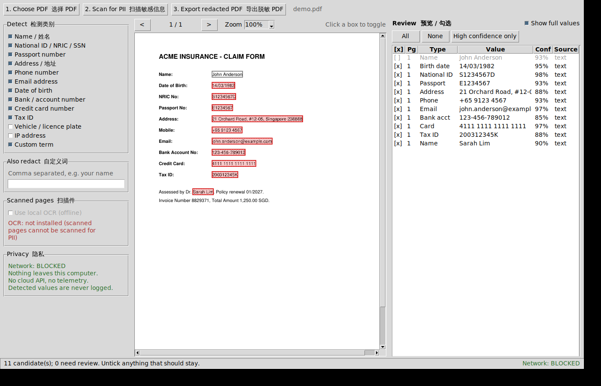

# LocalRedact — 完全离线的 PDF 脱敏工具 (Windows)

选择 PDF → 扫描敏感信息 → 预览/勾选 → 导出脱敏 PDF。



*左侧选类别、右侧逐条勾选、中间页面上直接点框切换。默认打码显示；勾上
`Show full values` 才显示完整值（下图，同时演示取消勾选第一项后框变灰）。*



全程在本机运行。**不上传任何 PDF、文本、图像、元数据或用户信息**，不调用任何云端 API，
不做遥测，不做自动更新。程序启动时会主动禁用整个进程的网络能力 —— 任何一次外连尝试都会
直接抛异常，而不是悄悄发出去。

---

## 1. 它到底做了什么

| 步骤 | 说明 |
|------|------|
| **1. 选择 PDF** | 本地打开，不复制、不上传 |
| **2. 扫描敏感信息** | 逐页提取文字 **及每个字符的坐标**，用规则 + 校验位算法找出 PII |
| **3. 预览 / 勾选** | 页面预览上画框，右侧列表逐条勾选/取消；低置信度项标记 `REVIEW` |
| **4. 导出** | 真正的 redaction：**删除底层内容**，清空元数据，导出后自动回读校验 |

### 真 redaction，不是盖黑框

盖一个黑色方块**不是脱敏** —— 文字仍然留在 PDF 的内容流里，随便一个提取工具就能读回来。

本工具使用 MuPDF 的 redaction annotation，重写页面内容流：

* `text=PDF_REDACT_TEXT_REMOVE` — 字形从内容流中**删除**
* `images=PDF_REDACT_IMAGE_PIXELS` — 框内的**栅格像素被重绘**（扫描件必需）
* `graphics=PDF_REDACT_LINE_ART_REMOVE_IF_COVERED` — 被遮住的矢量图形一并删除
* 保存时 `garbage=4, clean=True, incremental=False` — 物理丢弃被替换的旧对象

仓库里的测试 `test_naive_black_box_would_fail_the_same_check` 就是用来证明这个区别的：
对同一份文件，"画黑框"的做法在字节层面仍然泄漏全部 12 个敏感值，本工具泄漏 0 个。

### 元数据清理

导出时会移除：文档信息字典（title/author/subject/keywords/creator/producer）、XMP
元数据、嵌入文件与附件、JavaScript、表单字段值与 AcroForm、注释/批注、链接目标、
页面缩略图，以及**隐藏文字层**（扫描件里常见的不可见 OCR 文本）。

---

## 2. 能检测什么

| 类别 | 手段 | 典型置信度 |
|------|------|-----------|
| 姓名 NAME | 标签（`Name:` / `姓名:` / `持卡人:`）、称谓（Mr/Dr/…）、大写词序列启发式 | 0.93 / 0.90 / 0.45–0.70 |
| 身份证件 NATIONAL_ID | **新加坡 NRIC/FIN 校验位**、**中国身份证 GB11643 校验位**、**香港 HKID 校验位**、马来西亚 MyKad、美国 SSN 有效区段、Aadhaar | 0.55–0.98 |
| 护照 PASSPORT | 标签 + 号码形态、MRZ 机读码行 | 0.93–0.95 |
| 地址 ADDRESS | 标签、街道类型词、新加坡 `Blk`/`#12-05`/六位邮编、英美邮编、中文省市区路号 | 0.72–0.90 |
| 电话 PHONE | 标签、E.164、新加坡 8 位、北美 10 位 | 0.72–0.93 |
| 邮箱 EMAIL | RFC 形态 | 0.97 |
| 出生日期 DATE_OF_BIRTH | 标签 + 日期解析 + 合理性检查（未来日期/年龄>120 降权） | 0.60–0.95 |
| 银行账号 BANK_ACCOUNT | **IBAN mod-97 校验**、SWIFT/BIC、标签化账号、Routing/Sort code | 0.85–0.97 |
| 信用卡 CREDIT_CARD | **Luhn 校验** + 发卡行识别 | 0.90–0.97 |
| 税号 TAX_ID | TIN/EIN/VAT/GST/UEN 标签 | 0.88 |
| 自定义 CUSTOM | 用户自己填的词（比如你的名字） | 1.00 |
| 车牌 / IP | 形态匹配（默认不勾选） | 0.45–0.80 |

**置信度怎么来的**（按可信度从高到低）：
校验位通过 → 0.95+；旁边有明确标签 → 0.85–0.95；只有形态像 → 0.45–0.65。

低于 **0.75** 的一律标 `REVIEW`，提醒人工复核。校验位失败的证件号**不会被丢弃**，只会降到
低置信度 —— 因为 OCR 错一个字符就会让校验位失败，直接丢掉反而会漏掉真的证件号。

---

## 3. 安装与运行

> **Windows 安装看这里 → [docs/INSTALL_WINDOWS.md](docs/INSTALL_WINDOWS.md)**
> 三条路线(下载现成 exe / 自己构建 / 源码运行)、SmartScreen 与杀毒误报怎么处理、
> OCR 怎么装、装到哪里、怎么卸载,都写清楚了。
>
> 最短路径:下载 CI 产物 → `.\packaging\install.ps1`(先加 `-DryRun` 看它要做什么)。
> 不需要管理员权限。

### 源码方式

需要 Windows + Python 3.9 以上（[python.org](https://www.python.org/downloads/windows/)
官方安装包，安装时**勾选 `tcl/tk and IDLE`**，GUI 需要它）。

```bat
cd pdf_redactor
python -m venv .venv
.venv\Scripts\activate
pip install -r requirements.txt

python run_app.py
```

### 命令行（批量处理 / 无界面）

```bat
REM 只列出检测结果，不写任何文件（值默认打码显示）
python -m app.cli report.pdf

REM 脱敏导出
python -m app.cli report.pdf -o report_clean.pdf

REM 只处理高置信度项；加上自定义词
python -m app.cli report.pdf -o clean.pdf --min-confidence 0.9 -t "张伟" "Acme Pte Ltd"

REM 扫描件（需要装好离线 OCR，见下一节）
python -m app.cli scan.pdf -o clean.pdf --ocr --ocr-lang eng+chi_sim

REM 检查一份 PDF 里还剩下什么
python -m app.cli clean.pdf --inspect
```

退出码：`0` 成功且校验通过，`1` 没有可导出的项，`2` 打不开文件，`3` **导出后校验失败**
（这种情况下不要分发该文件）。

---

## 4. 扫描件 / OCR（可选，必须离线）

文本型 PDF 开箱即用。扫描件没有文字层，需要本地 OCR。两个方案二选一，**都是纯本地运行**：

**方案 A — Tesseract（推荐，框更贴合）**

词级别坐标，脱敏框更精确。
1. 下载离线安装包：<https://github.com/UB-Mannheim/tesseract/wiki>
2. 中文识别需勾选 `chi_sim` / `chi_tra` 语言包
3. `pip install pytesseract Pillow`

程序按以下顺序自动查找：`LOCALREDACT_TESSERACT` 环境变量 → exe 同级的 `tesseract\` 目录
→ `C:\Program Files\Tesseract-OCR\` → PATH。

**方案 B — RapidOCR（纯 pip，零外部依赖）**

ONNX 模型直接打包在 wheel 里，首次运行**不会下载任何东西**。
```bat
pip install rapidocr-onnxruntime Pillow
```
行级别坐标，脱敏框会略宽一点 —— 宁可多盖，不会少盖。

**OCR 结果一律标记为需人工复核。** 界面上会显示每一项的 OCR 置信度（如 `OCR 91%`），
低于 80% 强制标 `REVIEW`。没有文字层又没开 OCR 的页面，扫描结束时会明确列出页码并警告
"这些页没有被检查过"。

---

## 5. 拿到 .exe

### 方式 A：直接下载 CI 构建好的（不需要装任何东西）

仓库带了 `.github/workflows/build-localredact.yml`，只要 `pdf_redactor/` 有改动就会在
**真实的 windows-latest runner** 上跑：装依赖 → 跑测试 → 校验图标 → PyInstaller 打包 →
校验 exe 的版本资源和内嵌图标 → **在 Windows 上跑一遍完整脱敏 + 字节级泄漏检查** →
上传产物。

去 GitHub 仓库的 **Actions → Build LocalRedact.exe → 最新一次运行 → Artifacts**，
下载 `LocalRedact-windows-exe`，解压即得 `LocalRedact.exe`。产物保留 90 天。

已验证的一次构建（windows-latest / Python 3.12.10 / PyInstaller 6.16.0）：

```
31/31 engine tests          PASS
14/14 headless GUI checks   PASS
localredact.ico OK: 7 sizes [16,24,32,48,64,128,256], 8,031 bytes
Copying icon to EXE                       <- 外壳图标已嵌入
Copying version information to EXE        <- 版本资源已嵌入
Size:            30.3 MB
ProductName:     LocalRedact
FileDescription: LocalRedact - offline PDF redaction
FileVersion:     1.0.0.0
Embedded icon:   32x32
Windows end-to-end OK: 4 area(s) redacted, 4 verified empty,
                       0 bytes leaked, metadata clear
```

单文件，无需安装器，目标机器**不需要装 Python**。

### 方式 B：本地自己打

```bat
cd pdf_redactor
packaging\build_exe.bat
```

脚本会建虚拟环境、装依赖、**先跑完整测试套件**（测试不过就拒绝打包）、再调用 PyInstaller，
产出 `dist\LocalRedact.exe` —— 单文件，无需安装器，无需目标机器有 Python。

PowerShell 版本：`.\packaging\build_exe.ps1`

想把 OCR 一起打包进去：
* Tesseract：把整个安装目录复制到 `pdf_redactor\tesseract\`，spec 会自动打包
* RapidOCR：在 build 脚本里取消对应的 `pip install` 注释即可

### 图标


`packaging/localredact.ico` 是 7 个尺寸（16/24/32/48/64/128/256）的多分辨率图标，
**每个尺寸都是从矢量单独渲染的**，不是从一张大图缩下来的 —— 所以 16px 的任务栏图标依然清晰。

```bat
python packaging\make_icon.py           REM 重新生成
python packaging\make_icon.py --check   REM 校验结构（CI 会跑）
```

图标在两个地方生效，机制不同、都需要：
* **exe 的外壳图标** —— spec 里的 `icon=` 参数写进 PE 资源
* **窗口标题栏 / 任务栏图标** —— 运行时由 `gui.py:_set_window_icon()` 读取，
  所以 ico 和 png 也作为 data 打进了 exe

`packaging/version_info.txt` 提供文件属性里的版本信息（产品名、说明、版本号）。

spec 里的两个刻意选择：
* `upx=False` —— 压缩后的 exe 很容易被杀软误报，这个工具需要看起来可信
* `excludes` 里排除了 `requests` / `urllib3` / `smtplib` 等网络库 —— 让"不联网"成为
  结构性事实，而不只是一条规定

---

## 6. 安全设计

| 保证 | 实现 |
|------|------|
| **不联网** | `app/safety.py:enable_network_lockdown()` 在**任何其他导入之前**替换 `socket.socket.connect` / `connect_ex` / `send*` / `create_connection` / `getaddrinfo`，全部抛 `NetworkBlockedError`。DNS 查询也一并阻断。界面状态栏常驻显示 `Network: BLOCKED` |
| **不记录敏感日志** | 日志只输出到 stderr，**不写文件**。内容只有类别、页码、数量。`_NoSensitiveDataFilter` 会丢弃任何标记为 `sensitive` 的记录 |
| **临时文件及时清除** | `SecureTempDir` 把 `tempfile.tempdir` 重定向到私有目录（权限 0700），退出时用随机字节覆写再删除，并注册 `atexit` 以防崩溃残留。第三方库（如 OCR）写的中间文件也落在这个目录里 |
| **不覆盖原件** | 输出路径与输入相同时直接拒绝 |
| **导出即校验** | 写完后**重新打开**输出文件，逐个脱敏框做 `get_text(clip=...)`，必须提取不到任何文字；再做一次全文比对；再确认元数据为空。失败会在界面上红字警告"不要分发此文件" |
| **界面默认打码** | 检测到的值默认显示为 `Jo*********on`，要看全文需主动勾选 `Show full values` |

---

## 7. 已知边界（请务必读）

* **没有文字层又没开 OCR 的页面 = 完全没被检查。** 程序会明确告诉你是哪几页，但不会替你
  假装处理过。
* **姓名检测是启发式的，不是 NER 模型。** 有标签（`Name:`）或称谓（`Dr.`）时很准；孤立的
  大写词序列只能给低置信度。**这正是"人工勾选"这一步存在的理由** —— 不要跳过它。
  把你自己/家人的名字填进"自定义词"框是最可靠的补充办法。
* **OCR 输出是近似的。** 坐标是估计的，文字可能识别错。OCR 页的每一项都需要人眼过一遍。
* **加密 PDF 不支持。** 请先用密码打开并另存一份无密码副本。
* **脱敏框外的信息不会被处理。** 照片里的人脸、签名、水印、页眉里的公司名 —— 这些不在
  检测范围内，需要你在预览里自己确认。
* **导出前请一定看一遍预览。** 这个工具的定位是"把 95% 的活自动干掉并给你一个可审的清单"，
  不是"闭眼点三下就能对外发布"。

---

## 8. 测试

```bat
python tests\test_localredact.py        REM 31 个引擎 + 打包测试
python tests\smoke_gui_headless.py      REM 14 个界面逻辑检查（无需 tkinter）
python tests\ci_windows_e2e.py          REM Windows 上的端到端 + 字节级泄漏检查
```

`test_localredact.py` 的 31 个测试，覆盖：

* 所有校验位算法的边界值（Luhn / NRIC / 中国身份证 / HKID / IBAN / SSN / MyKad）
* 检测规则的正例与**反例**（16 位发票号不能被当成信用卡；干净文档不能有高置信度误报）
* 字符坐标映射与页面几何的一致性
* **字节级脱敏验证** —— 重建输出文件的原始字节 + 全部解压对象 + 页面内容流，
  用 ASCII / hex / UTF-16 三种编码搜索敏感值，必须一个都搜不到
* **反向对照测试** —— 证明"画黑框"的做法会在同一个检查下失败（否则前一个测试没有意义）
* 扫描件路径：框内像素必须被重绘为纯黑
* 元数据清空、未勾选项必须保留、拒绝覆盖原件
* **旋转页面**（`/Rotate 90`）坐标正确 —— 框必须落在对的位置，且不能误伤相邻行
* 跨行值、只在第 3 页有命中、空白页、全部取消勾选、部分勾选（同一个值出现两次只脱敏一次）
* **标签边界回归测试** —— 曾经 `ic`（身份证标签）会匹配到 `Publ*ic* notice` 里面，
  把一句普通英文变成高置信度证件号命中
* 网络封锁、临时目录覆写销毁、日志过滤
* **打包配置** —— 用桩件 exec 一遍 `.spec`（而且故意从别的工作目录跑），确认入口脚本、
  数据文件、图标、版本资源都真实存在，且 exe 保持无控制台 / 不用 UPX / 排除网络库。
  这条是回归测试：`.spec` 里的相对路径是相对**spec 文件所在目录**解析的，不是工作目录，
  第一次 Windows 构建就是因此 1 秒内失败的
* 图标是结构合法的 7 尺寸 PNG-ICO

也可以用 pytest：`pytest tests/test_localredact.py`

`smoke_gui_headless.py` 用桩件替换 tkinter，在没有图形环境的机器上跑通界面的构造与
纯逻辑路径（表格刷新、勾选切换、预览框生成、打码显示、页面导航边界、关闭时清理）。
它检查的是代码正确性，不是视觉排版 —— 界面外观请在 Windows 上用 `python run_app.py` 实际看。

---

## 9. 代码结构

```
pdf_redactor/
├── run_app.py              入口（先锁网络，再加载 GUI）
├── requirements.txt
├── app/
│   ├── safety.py           网络封锁 / 安全临时目录 / 日志过滤
│   ├── models.py           Detection / PageText / 字符坐标映射
│   ├── validators.py       Luhn、NRIC、中国身份证、HKID、IBAN、SSN、日期
│   ├── lexicon.py          停用词、称谓、标签词、街道类型、名字表
│   ├── detectors.py        规则集 + 置信度 + 重叠消解
│   ├── extractor.py        PyMuPDF rawdict → 逐字符坐标
│   ├── ocr.py              离线 OCR（Tesseract / RapidOCR）
│   ├── redactor.py         真 redaction + 元数据清理 + 回读校验
│   ├── scanner.py          编排：提取 → OCR → 检测
│   ├── gui.py              Tkinter 界面
│   └── cli.py              命令行
├── tests/test_localredact.py
└── packaging/
    ├── localredact.spec    PyInstaller 配置
    ├── build_exe.bat
    └── build_exe.ps1
```

核心不变量：**页面文本里的每一个字符，都知道自己在页面上的矩形位置。**
这就是正则命中能变成精确脱敏框、而不是靠猜的原因。

---

## 10. 常见问题

**打开程序报 `ModuleNotFoundError: tkinter`**
用 python.org 的官方安装包重装 Python，勾选 `tcl/tk and IDLE`。或者用命令行版本。

**杀毒软件报毒**
PyInstaller 单文件 exe 的常见误报。spec 已关闭 UPX 压缩以降低概率。可以加白名单，或者
直接用源码方式运行。

**预览页面显示不出来**
`tk.PhotoImage` 需要 Tk 8.6+（Python 3.7 起自带）。检查 `python -c "import tkinter; print(tkinter.TkVersion)"`，应 ≥ 8.6。

**导出后提示 "VERIFICATION FAILED"**
说明回读校验发现脱敏框里还能提取到文字。**不要分发这个文件。** 通常是 PDF 结构异常
（少见）。可以试试在界面上把该项两侧的框选得大一点，或提一个带样例的 issue。

**中文识别不出来**
OCR 语言代码要写 `chi_sim`（简体）或 `chi_tra`（繁体），可以叠加：`eng+chi_sim`。
并确认 Tesseract 安装时勾选了对应语言包。
